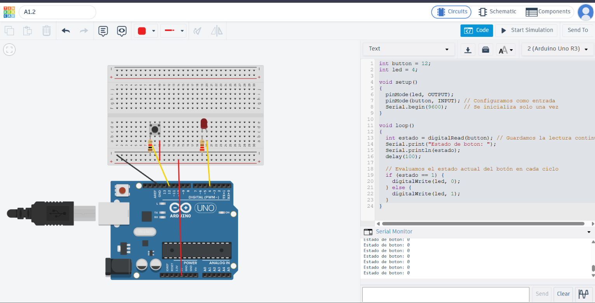

# 📚 Actividad A1.2: Avances de Proyecto 1 — Sistema de Botón y LED

> Primera etapa de un sistema de entretenimiento tipo juego de memoria, desarrollado con Arduino para la materia de Proyectos Intro a la Ingeniería (UDEM).

---

## 1) Resumen

- **Materia:** Proyectos Intro a la Ingeniería
- **Profesor:** Dr. Antonio Martínez Torteya
- **Equipo:** 
  - Juan Carlos Valdés Pérez
  - Antonio Isidoro Ureña Chaidez 
  - Marcelo Cantú Palacios
  - Sofía Posas
- **Fecha:** 24/08/2026
- **Placa:** Arduino Uno R3 (Elegoo)
- **Descripción breve:** Circuito que utiliza un pulsador (*push button*) para apagar un LED mientras se mantiene presionado, demostrando el uso de pines de entrada y salida digital como base para el sistema completo de juego de memoria.

---

## 2) Introducción

El presente reporte documenta el desarrollo de la primera etapa de un sistema de entretenimiento tipo juego de memoria, el cual será construido a lo largo del curso de Proyectos Intro a la Ingeniería. El sistema completo constará de tres botones y tres LEDs de distintos colores; su funcionamiento consistirá en encender los LEDs de forma aleatoria para que el usuario presione el botón correspondiente al color encendido, apagando dicho LED y encendiendo uno nuevo, hasta completar una secuencia de diez aciertos. Al finalizar la secuencia, el sistema contabilizará el tiempo y emitirá una señal auditiva de victoria o derrota según el desempeño obtenido.

El objetivo particular de esta actividad es implementar y documentar el componente elemental del sistema: la interacción entre un botón y un LED mediante un microcontrolador Arduino. Específicamente, se diseñó un circuito en el cual el LED permanece encendido en su estado natural (reposo) y se apaga únicamente mientras el botón sea presionado por el usuario. Este primer avance permite validar la lectura digital de entradas, el control de salidas y el manejo de niveles lógicos estables.

---

## 3) Metodología

### 3.1 Conexiones

**Componentes utilizados y justificación técnica:**

- **1 LED (Diodo Emisor de Luz):** Actúa como el indicador visual del sistema. Requiere polarización directa para encender.
- **1 Resistencia de 220 Ω (Limitadora para el LED):** Un LED rojo estándar de 5 mm presenta un voltaje directo ($V_f$) aproximado de 2.0 V y requiere una corriente nominal ($I_f$) de entre 15 mA y 20 mA. Aplicando la Ley de Ohm a partir de la fuente de 5 V del microcontrolador:
  $$R = \frac{V_{\text{fuente}} - V_f}{I_f} = \frac{5\text{ V} - 2\text{ V}}{0.015\text{ A}} = 200\ \Omega$$
  Se seleccionó el valor comercial estandarizado más cercano por encima del valor calculado: **220 Ω** (bandas: Rojo, Rojo, Café, Dorado). Esto fija una corriente de operación segura de:
  $$I = \frac{5\text{ V} - 2\text{ V}}{220\ \Omega} \approx 13.63\text{ mA}$$
  Este nivel de corriente protege al diodo de sobrecalentamiento y daños permanentes, asegurando una visibilidad óptima.
- **1 Pulsador (*Push Button*):** Interruptor momentáneo que permite la interacción del usuario.
- **1 Resistencia de 10 kΩ (Pull-Down para el botón):** Evita el estado de alta impedancia o "pin flotante" cuando el botón no está presionado, garantizando una referencia de 0 V (LOW) ante el ruido electromagnético ambiental. Al presionarse el botón, limita el consumo de corriente hacia tierra a solo $I = \frac{5\text{ V}}{10{,}000\ \Omega} = 0.5\text{ mA}$.
- **Protoboard y Jumpers:** Permiten el ruteo y ensamblaje ordenado del circuito sin soldadura.

**Descripción de las conexiones físicas:**

- **Circuito de Salida (LED):** El ánodo del LED (terminal larga) se conecta directamente al **Pin Digital 4** del Arduino. El cátodo (terminal corta) se conecta en serie con el resistor de 220 Ω, el cual cierra el circuito hacia el riel común de tierra (**GND**).
- **Circuito de Entrada (Botón con Pull-Down):** Una de las terminales del pulsador se conecta a la línea de alimentación de **5V**. La terminal opuesta se conecta simultáneamente a dos puntos: al **Pin Digital 12** (para la lectura digital) y a un extremo del resistor de 10 kΩ, cuyo otro extremo va conectado a **GND**.

**Diagrama de conexiones:**


*(Nota: El archivo de imagen y diagrama esquemático editable se encuentra adjunto en la carpeta `/Recursos/imgs/` del repositorio).*

---

### 3.2 Código

El sketch de Arduino implementa una arquitectura secuencial y de muestreo cíclico para procesar la señal de entrada y conmutar la salida digital.

**Declaración de variables globales:**
 
Al inicio del sketch se declararon dos variables globales de tipo `int`: `button = 12` y `led = 4`. En lugar de escribir los números de pin directamente cada vez que se necesitan, se les asignó un nombre descriptivo. Esto hace el código más legible (queda claro qué representa cada pin sin tener que recordarlo) y más fácil de mantener: si en el futuro se cambia el componente de pin físico, solo se modifica un lugar en el código en vez de buscar cada instancia del número.
 
**Configuración (`setup()`):**
 
La función `setup()` se ejecuta una única vez al energizar o reiniciar el Arduino, y aquí se define el comportamiento inicial del sistema:
 
- `pinMode(led, OUTPUT)` — configura el pin 4 como salida, ya que el Arduino debe *enviar* una señal eléctrica hacia el LED para encenderlo o apagarlo.
- `pinMode(button, INPUT)` — configura el pin 12 como entrada, ya que el Arduino debe *leer* el estado eléctrico que le llega desde el circuito del botón.
- `Serial.begin(9600)` — inicializa la comunicación serial a una velocidad de 9600 baudios. Esto habilita el uso del Monitor Serial del IDE de Arduino, lo que permitió observar en tiempo real el valor leído del botón durante las pruebas, sirviendo como herramienta de depuración y como evidencia del funcionamiento correcto del sistema (ver sección de Resultados). Al estar en `setup()`, esta inicialización ocurre una sola vez, ya que no es necesario repetirla en cada ciclo.
**Ejecución (`loop()`):**
 
La función `loop()` se ejecuta de forma continua e indefinida mientras el Arduino esté encendido. En cada ciclo:
 
1. `int estado = digitalRead(button);` — se lee el valor eléctrico actual del pin del botón (0 si no está presionado, 1 si está presionado, gracias a la resistencia pull-down) y se guarda en la variable local `estado`.
2. `Serial.print("Estado de boton: "); Serial.println(estado);` — se imprime el valor leído en el Monitor Serial, permitiendo verificar visualmente, en tiempo real, que la lectura del botón corresponde con su estado físico real.
3. `delay(100);` — se introduce una pausa de 100 milisegundos antes de continuar. Esto evita que el Monitor Serial se sature con miles de líneas por segundo (el Arduino podría leer y imprimir el estado decenas de miles de veces por segundo sin esta pausa), facilitando la lectura humana de los datos durante las pruebas.
4. `if (estado == 1) { digitalWrite(led, 0); } else { digitalWrite(led, 1); }` — esta es la lógica central del sistema: si el botón está presionado (`estado == 1`), se apaga el LED escribiendo un valor bajo (`0`, equivalente a `LOW`) en su pin; si el botón no está presionado, se enciende el LED escribiendo un valor alto (`1`, equivalente a `HIGH`). Es importante notar que en Arduino las constantes `HIGH` y `LOW` son en realidad `1` y `0` respectivamente, por lo que ambas formas de escribirlo son funcionalmente idénticas.
Como este bloque de código se repite en cada iteración del `loop()`, el sistema responde de forma prácticamente inmediata (con la única pausa de 100 ms) a cualquier cambio en el estado del botón, cumpliendo con el comportamiento esperado: el LED permanece encendido por defecto y se apaga únicamente mientras el botón se mantiene presionado.

**Código:**

```cpp
// Declaración de pines globales
int button = 12; // Pin digital asignado a la lectura del pulsador
int led = 4;      // Pin digital asignado al control del LED

void setup() {
  // Configuración del comportamiento de los pines
  pinMode(led, OUTPUT);    // Pin 4 configurado como salida digital
  pinMode(button, INPUT);  // Pin 12 configurado como entrada digital
  
  // Inicialización del puerto serie para telemetría
  Serial.begin(9600);     // Comunicación serial a 9600 baudios
}

void loop() {
  // 1. Muestreo de la señal digital
  int estado = digitalRead(button); // Lectura del pin 12 (0 = LOW, 1 = HIGH)
  
  // 2. Transmisión de datos al Monitor Serie
  Serial.print("Estado de boton: ");
  Serial.println(estado);
  delay(100); // Retardo de estabilización y tasa de refresco (100 ms)

  // 3. Lógica de control condicional (Lógica Invertida)
  if (estado == 1) {
    digitalWrite(led, 0); // Si el botón está presionado (HIGH), apaga el LED (LOW)
  } else {
    digitalWrite(led, 1); // Si el botón está en reposo (LOW), enciende el LED (HIGH)
  }
}
```
---
 
 ## 4) Resultados

A continuación se presentan las evidencias de funcionamiento del sistema tanto en simulación digital como en montaje físico:

### 4.1 Demostración en Simulación (Digital)
<p align="center">
  
</p>

### 4.2 Demostración en Hardware (Físico)
<p align="center">

https://github.com/user-attachments/assets/6c6a2f0c-a02e-4ec5-8352-e64ee4a22516

</p>
> 📹 **Respaldo:** En caso de requerir descarga directa, el archivo multimedia se encuentra en [`Video_Funcionamiento_Fisico.mp4`](./Recursos/videos/Video_Funcionamiento_Fisico.mp4)

---

### Validación de Comportamiento

- **Estado de Reposo:** Al energizar el circuito sin interactuar con el pulsador, el pin 12 detectó de forma continua un nivel lógico `0` (LOW) gracias a la resistencia pull-down, manteniendo el LED encendido de forma estable y sin parpadeos
- **Estado de Activación:** Al presionar y sostener el pulsador, el pin 12 conmutó a nivel lógico `1` (HIGH), provocando que el LED se apagara de manera inmediata. Al soltar el botón, el LED regresó instantáneamente a su estado encendido
- **Monitoreo Serie:** La consola serial registró con precisión y en tiempo real las transiciones numéricas (`0` y `1`) conforme a la interacción con el circuito.

---

## 5) Conclusiones

Se implementó y validó con éxito la primera etapa del sistema de entretenimiento, cumpliendo con la totalidad de los requerimientos técnicos fijados para la actividad A1.2:

- El dimensionamiento de la resistencia limitadora de 220 Ω mediante la Ley de Ohm demostró garantizar la protección eléctrica del diodo sin sacrificar visibilidad luminosa.
- La configuración pull-down con resistencia de 10 kΩ eliminó por completo los estados flotantes y el ruido en la entrada digital, asegurando lecturas booleanas limpias y repetibles.
- La estructura de control desarrollada en Arduino IDE validó el correcto manejo de entradas y salidas digitales bajo una lógica condicional invertida.

Esta arquitectura modular y documentada establece las bases técnicas necesarias para la siguiente fase del proyecto, en la cual se integrarán los dos botones y LEDs restantes, las rutinas de temporización y la generación aleatoria de secuencias para el juego de memoria completo.
