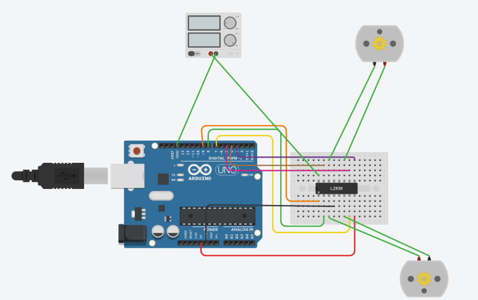

# 📚 Actividad A2.1: Control de Motores DC con Puente H L293D

> Implementación de un sistema de tracción bidireccional en Tinkercad utilizando Arduino y un controlador L293D para la materia de Proyectos Intro a la Ingeniería (UDEM). En esta práctica se gestiona el cambio de giro y la detención de dos motores de corriente continua.

---

## 1) Resumen

- **Materia:** Proyectos Intro a la Ingeniería
- **Profesor:** Dr. Antonio Martínez Torteya
- **Equipo:** Juan Carlos Valdés Pérez, Antonio Isidoro Ureña Chaidez, Marcelo Cantú Palacios, Sofía Posas
- **Fecha:** 28/09/2026
- **Placa:** Arduino Uno R3 (Simulación en Tinkercad)
- **Descripción breve:** Diseño y programación de un circuito en Tinkercad para controlar dos motores DC. Se utilizó un puente H (L293D) integrado a una fuente externa para proporcionar la potencia necesaria, permitiendo mediante código en C++ que los motores giren hacia adelante, inviertan su dirección y se detengan en un ciclo infinito y secuencial.

---

## 2) Introducción

El presente reporte documenta la integración de actuadores mecánicos (motores DC) controlados a través de un microcontrolador. Debido a que los motores requieren corrientes y voltajes superiores a los que un pin lógico del Arduino puede suministrar de manera segura, se hace indispensable el uso de una etapa de potencia independiente. 

El objetivo de esta práctica es implementar el circuito integrado L293D (Puente H) para aislar la lógica de control de la demanda energética de los motores. El sistema programado ejecuta un ciclo de prueba continuo en el que ambos motores avanzan sincronizadamente durante dos segundos, cambian su polaridad para retroceder otros dos segundos, y finalmente se detienen por completo antes de reiniciar el bucle, sentando las bases para el control de tracción de futuros proyectos móviles.

---

## 3) Metodología

### 3.1 Conexiones y Hardware

**Componentes utilizados y justificación técnica:**

- **1 Placa Microcontroladora (Arduino Uno R3):** Actúa como el cerebro del sistema. Los pines I/O del Arduino solo pueden suministrar un máximo absoluto de 40 mA por pin (recomendado 20 mA). Conectar un motor directamente quemaría la placa de inmediato.
- **1 Driver de Motor L293D (Puente H):** Es el componente central para la etapa de potencia. Consta internamente de transistores configurados en "H" que funcionan como interruptores electrónicos. Permite que las señales de baja corriente del Arduino controlen el flujo de alta corriente hacia los motores. Además, el modelo L293**D** incluye diodos *flyback* internos que protegen al circuito de los picos de voltaje generados por la inducción cuando los motores se detienen.
- **2 Motores de Aficionado (DC):** Actuadores rotativos para simular un sistema diferencial de tracción.
- **1 Fuente de Alimentación Externa (Configurada a 5 V y 5 A):** Se utiliza para alimentar de manera exclusiva a los motores a través del pin VCC2 del puente H. 
  - *Justificación matemática:* Los motores DC de aficionado en Tinkercad operan de manera óptima entre 3 V y 6 V, por lo que 5 V asegura buen torque sin sobrecalentamiento. En cuanto a la corriente, cada motor consume alrededor de 70-100 mA en funcionamiento libre y hasta ~500 mA en estado de bloqueo (*stall*). En el peor de los casos, ambos motores consumirían 1 A. Por ende, configurar el límite de la fuente a 5 A es completamente seguro (la fuente solo entrega lo que el circuito demanda) y está dentro de la capacidad de 600 mA por canal del L293D.

**Descripción de las conexiones físicas:**
- **Control de Motores (Lógica):** Los pines de control para el Motor A se conectaron a los pines digitales 9 (Enable A), 8 (IN1) y 7 (IN2) del Arduino. Para el Motor B, se utilizaron los pines 3 (Enable B), 5 (IN3) y 4 (IN4).
- **Potencia:** La alimentación lógica (VCC1) del puente H se conectó a los 5V del Arduino, mientras que la potencia para los motores (VCC2) se conectó al terminal positivo de la fuente de poder externa. Las tierras (GND) del Arduino, el L293D y la fuente externa se unificaron indispensablemente para establecer un nivel de referencia común (0V).

**Diagrama de conexiones:**
<p align="left">
 
</p>

*(Nota: El archivo de imagen se encuentra adjunto en el repositorio).*

---

### 3.2 Diseño de Software

El código fuente fue diseñado de manera secuencial utilizando la función `delay()` para gestionar las transiciones de estado de los motores.

**Configuración Inicial (`setup`):**
Se definieron todos los pines conectados al L293D como salidas (`OUTPUT`), incluyendo tanto los de habilitación (`enA`, `enB`) como los de control de giro (`in1` a `in4`). Para asegurar que el sistema inicie en reposo absoluto, se mandó un estado lógico `LOW` a todas las entradas de dirección.

**Ejecución Principal (`loop`):**
El ciclo de trabajo se dividió en tres etapas fundamentales. Primero, se habilitan ambos canales (`HIGH` en `enA` y `enB`). 
1. **Giro inicial:** `in1` e `in3` se ponen en estado `HIGH` mientras que `in2` e `in4` en `LOW`, generando el giro en un sentido durante 2000 ms.
2. **Inversión de giro:** Se invierten los estados lógicos (`in1/in3` a `LOW` y `in2/in4` a `HIGH`), alterando la polaridad entregada por el L293D y forzando a los motores a girar en sentido contrario durante otros 2000 ms.
3. **Freno/Reposo:** Se envían señales `LOW` a las cuatro entradas de dirección, deteniendo el flujo de corriente hacia los motores durante 2000 ms antes de repetir el bucle continuo.

**Código Fuente:**

```cpp
int enA = 9; 
int in1 = 8;
int in2 = 7; 

int enB = 3; 
int in3 = 5; 
int in4 = 4; 

void setup(){
	pinMode(enA, OUTPUT); 
	pinMode(enB, OUTPUT);
	pinMode(in1, OUTPUT);
	pinMode(in2, OUTPUT);
	pinMode(in3, OUTPUT);
	pinMode(in4, OUTPUT);
	
	digitalWrite(in1, LOW); 
	digitalWrite(in2, LOW);
	digitalWrite(in3, LOW);
	digitalWrite(in4, LOW);
}

void loop() {
  
  digitalWrite(enA, HIGH); 
  digitalWrite(enB, HIGH);
  
  // 1. Motores giran en dirección inicial
  digitalWrite(in1, HIGH); 
  digitalWrite(in2, LOW);
  digitalWrite(in3, HIGH);
  digitalWrite(in4, LOW);
  delay(2000); 
  
  // 2. Motores cambian de dirección
  digitalWrite(in1, LOW);
  digitalWrite(in2, HIGH); 
  digitalWrite(in3, LOW);
  digitalWrite(in4, HIGH); 
  delay(2000); 
	
  // 3. Motores se detienen
  digitalWrite(in1, LOW);
  digitalWrite(in2, LOW);
  digitalWrite(in3, LOW);
  digitalWrite(in4, LOW);
  delay(2000); 
}
```
(Nota: El archivo fuente tipo .ino se encuentra adjunto en el repositorio ). 

---

## 4) Resultados

A continuación se presentan las evidencias de funcionamiento del sistema, demostrando el comportamiento esperado:

### 4.1 Demostración en Simulación (Digital)
<p align="center">
  
</p>

### Validación de Comportamiento

- **Tracción Secuencial:** Se corroboró visualmente en la simulación que ambos motores inician su marcha de forma simultánea al activarse las señales correspondientes desde el microcontrolador.
- **Inversión Exitosa:** Tras transcurrir el tiempo establecido (2000 ms), la polaridad entregada por el L293D se invierte correctamente sin errores lógicos ni sobrecargas en la fuente, confirmando la conmutación adecuada de los interruptores internos del puente H.
- **Paro Total y Ciclo Infinito:** El sistema interrumpe efectivamente la corriente hacia los motores durante la fase de detención (al enviar un estado `LOW` generalizado a las entradas de control), reiniciando el ciclo de prueba de manera continua y estable.

---

## 5) Conclusiones

La implementación de la práctica A1.4 concluyó con éxito, cumpliendo íntegramente con los requisitos técnicos de control de dirección y aislamiento de potencia mediante el puente H L293D. La integración de la fuente de alimentación externa configurada a 5 V permitió comprobar la necesidad imperativa de separar la etapa lógica del Arduino de la demanda energética de los actuadores mecánicos, previniendo daños permanentes en el microcontrolador.

El manejo de los pines de habilitación y dirección mediante señales digitales en C++ demostró ser un método altamente eficiente para alterar la polaridad aplicada a los motores DC. Asimismo, el correcto conexionado de las tierras comunes garantizó la estabilidad de las señales de control. Esta práctica consolida los principios fundamentales de la cinemática diferencial, dejando la arquitectura de hardware y software lista para su futura aplicación en plataformas robóticas móviles que requieran maniobras complejas de desplazamiento.